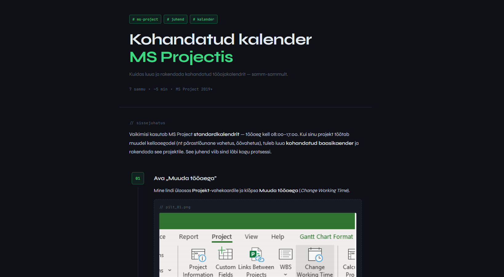

# 📁 MS Project Kalender — Juhend

> Samm-sammuline veebijuhend kohandatud kalendrite loomiseks **Microsoft Project's** — loodud GitHubi Pages abil.[^1]

---

## 📋 Sisukord

- [Projekti kirjeldus](#-projekti-kirjeldus)
- [Veebilehed](#-veebilehed)
- [Tehnoloogiad](#-tehnoloogiad)
- [Paigaldus](#-paigaldus)
- [Koodinäited](#-koodinäited)
- [Ülesannete nimekiri](#-ülesannete-nimekiri)
- [Autorist](#-autorist)

---

## 📖 Projekti kirjeldus

See repositoorium sisaldab **MS Project** kasutajajuhendit, mis on avaldatud GitHub Pages kaudu.[^2] Juhend katab ühe põhiteema:

1. **Kohandatud kalender** — kuidas luua ja rakendada oma tööajakalendrit MS Projectis

Veebileht on loodud puhta HTML, CSS ja JavaScriptiga — ilma raamistiketa.

---

## 🌐 Veebilehed

### Avalehekülg — Kalender



*Kohandatud kalendri loomise samm-sammuline juhend MS Projectis.*

---

## 🛠 Tehnoloogiad

| Tehnoloogia | Kasutus |
|-------------|---------|
| `HTML5` | Lehe struktuur |
| `CSS3` | Kujundus ja animatsioonid |
| `JavaScript` | Scroll-animatsioonid, lightbox |
| `GitHub Pages` | Majutus ja avaldamine |
| `JetBrains Mono` | Monoruumiline font (Google Fonts) |
| `Syne` | Peamine font (Google Fonts) |

---

## ⚙️ Paigaldus

### Kloonimine SSH kaudu

```bash
git clone git@github.com:KASUTAJANIMI/project-calendar.git
cd project-calendar
```

### GitHub Pages seadistamine

```bash
# Kontrolli aktiivset haru
git branch

# Lülitu main harusse
git checkout main

# Avalda GitHub Pages kaudu:
# Settings → Pages → Source: main branch → Save
```

---

## 💻 Koodinäited

### HTML — sammu struktuur

Iga juhendi samm on üles ehitatud järgmise HTML-struktuuriga:[^3]

```html
<article class="step">
  <div class="step-aside">
    <span class="step-num">01</span>
    <div class="step-line"></div>
  </div>
  <div class="step-content">
    <h2>Sammu pealkiri</h2>
    <p>Sammu kirjeldus ja juhised.</p>
  </div>
</article>
```

### CSS — teema muutujad

Kogu saidi värvid ja fondid on määratud CSS muutujatena:

```css
:root {
  --bg:        #0e1117;
  --surface:   #161b24;
  --border:    #252d3a;
  --green:     #3ddc84;
  --green-dim: #1f6b43;
  --text:      #cdd6e0;
  --muted:     #566474;
}
```

### JavaScript — scroll-animatsioon

Sammude ilmumine kerimise ajal on teostatud `IntersectionObserver` API-ga:

```javascript
const steps = document.querySelectorAll('.step, .intro, .summary');
const obs = new IntersectionObserver(entries => {
  entries.forEach(e => {
    if (e.isIntersecting) e.target.classList.add('visible');
  });
}, { threshold: 0.08 });

steps.forEach(s => obs.observe(s));
```

---

## ✅ Ülesannete nimekiri

### Põhiülesanded

- [x] Loo `main` haru MS Projecti juhendiga
- [x] Loo `index.html` kalendri juhendiga
- [x] Lisa `style.css` kujundusfail
- [x] Lisa scroll-animatsioonid ja lightbox
- [x] Avalda GitHub Pages kaudu
- [ ] Lisa ekraanitõmmised kõigile sammudele
- [ ] Optimeeri mobiilivaade

---

## ⚠️ Hoiatused ja märkused

> [!NOTE]
> See haru (`main`) sisaldab MS Projecti juhendit. ProjectLibre juhend asub eraldi harus `projectLibre`.

> [!TIP]
> Piltide lisamiseks aseta ekraanitõmmised repositooriumi juurkausta ja viita neile `` süntaksiga.

> [!IMPORTANT]
> MS Project on tasuline tarkvara. Juhend eeldab versiooni **MS Project 2019** või uuemat.[^4]

> [!WARNING]
> Kui ülesanded on seadistatud käsitsi ajastamisele (`Manual Schedule`), ignoreerivad need kalendrit täielikult. Lülita kõik ülesanded **Auto Schedule** peale.

> [!CAUTION]
> Ära muuda `main` haru faile otse — tee muudatused alati eraldi harus ja kasuta Pull Request'i.

---

## 📂 Projekti struktuur

```
project-calendar/          ← main haru
├── index.html             # MS Project kalendri juhend
├── style.css              # Saidi kujundus
├── README.md              # See fail
├── step1.png              # Sammude ekraanitõmmised
├── step2.png
└── ...
```

---

## 👤 Autorist

**Artjom Põldsaar**
- GitHub: [@GummyisHear](https://github.com/GummyisHear)
- Kursus: Noorem Tarkvaraarendaja, 2026

---

[^1]: GitHub Pages on GitHubi tasuta staatiline veebimajutusteenus, mis avaldab repositooriumis olevad HTML-failid automaatselt veebis.
[^2]: Juhend on loodud õppeotstarbel ning ei ole seotud Microsofti ametliku dokumentatsiooniga.
[^3]: HTML-struktuur kasutab CSS Grid paigutust, kus vasakul on sammu number ja paremal sisu.
[^4]: Varasematel versioonidel (2016, 2013) võivad menüüde asukohad ja nimetused erineda.

---

*MS Project juhend · Artjom Põldsaar 2026*
