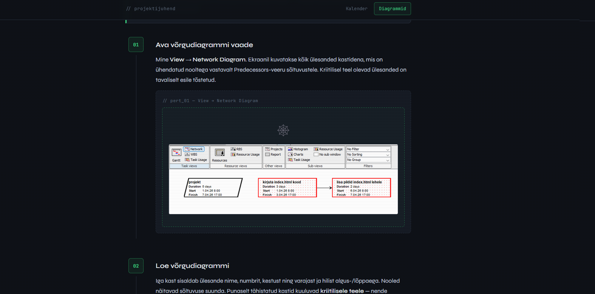

# 📁 ProjectLibre Juhend

> Samm-sammuline veebijuhend kohandatud kalendrite ja diagrammide loomiseks **ProjectLibre's** — loodud GitHubi Pages abil.[^1]

---

## 📋 Sisukord

- [Projekti kirjeldus](#-projekti-kirjeldus)
- [Veebilehed](#-veebilehed)
- [Tehnoloogiad](#-tehnoloogiad)
- [Paigaldus](#-paigaldus)
- [Koodinäited](#-koodinäited)
- [Ülesannete nimekiri](#-ülesannete-nimekiri)
- [Autorist](#-autorist)

---

## 📖 Projekti kirjeldus

See repositooriumi haru `projectLibre` sisaldab **ProjectLibre** kasutajajuhendit, mis on avaldatud GitHub Pages kaudu.[^2] Juhend katab kaks põhiteemat:

1. **Kohandatud kalender** — kuidas luua ja rakendada oma tööajakalendrit
2. **Diagrammid** — Gantt-diagramm, ressursside diagramm ja võrgudiagramm (PERT)

ProjectLibre on tasuta ja avatud lähtekoodiga alternatiiv MS Projectile.[^3]

---

## 🌐 Veebilehed

### Avalehekülg — Kalender


*Kohandatud kalendri loomise samm-sammuline juhend ProjectLibre's.*

### Diagrammide leht



*Gantt, ressursside ja võrgudiagrammi juhendid.*

---

## 🛠 Tehnoloogiad

| Tehnoloogia | Kasutus |
|-------------|---------|
| `HTML5` | Lehe struktuur |
| `CSS3` | Kujundus ja animatsioonid |
| `JavaScript` | Scroll-animatsioonid, lightbox |
| `GitHub Pages` | Majutus ja avaldamine |
| `JetBrains Mono` | Monoruumiline font (Google Fonts) |
| `Syne` | Peamine font (Google Fonts) |

---

## ⚙️ Paigaldus

### Kloonimine SSH kaudu

```bash
git clone git@github.com:KASUTAJANIMI/project-calendar.git
cd project-calendar
```

### Haru loomine ja vahetamine

```bash
# Loo uus haru ja lülitu sellele
git checkout -b projectLibre

# Või kui haru on juba olemas
git checkout projectLibre
```

### Muudatuste salvestamine

```bash
# Lisa muutunud failid
git add index.html diagramm.html style.css README.md

# Tee commit koos issue viitega
git commit -m "Update index.html with ProjectLibre calendar guide — Closes #1"

# Lükka muudatused GitHubi
git push origin projectLibre
```

### GitHub Pages seadistamine

```bash
# Kontrolli, et oled õiges harus
git branch --show-current
# Väljund peaks olema: projectLibre

# GitHub Pages seadistus tehakse veebis:
# Settings → Pages → Source: projectLibre → Save
```

---

## 💻 Koodinäited

### HTML — navigeerimismenüü struktuur

Mõlemal lehel kasutatakse sama kleepuvat navigeerimismenüüd:[^4]

```html
<nav class="site-nav">
  <div class="nav-inner">
    <span class="nav-brand">// projektijuhend</span>
    <div class="nav-links">
      <a href="index.html" class="nav-link active">Kalender</a>
      <a href="diagramm.html" class="nav-link">Diagrammid</a>
    </div>
  </div>
</nav>
```

### CSS — kleepuv navigatsioon

Navigeerimismenüü jääb kerimise ajal ekraani ülaossa `position: sticky` abil:

```css
.site-nav {
  position: sticky;
  top: 0;
  z-index: 100;
  background: rgba(14, 17, 23, 0.92);
  border-bottom: 1px solid var(--border);
  backdrop-filter: blur(8px);
}

.nav-link.active {
  color: var(--green);
  border-color: var(--green-dim);
  background: rgba(61, 220, 132, 0.06);
}
```

### JavaScript — lightbox piltide suurendamiseks

Piltidel klõpsamisel avaneb täisekraani lightbox:

```javascript
const lightbox = document.getElementById('lightbox');
const lightboxImg = document.getElementById('lightbox-img');

document.querySelectorAll('.zoomable').forEach(img => {
  img.addEventListener('click', () => {
    lightboxImg.src = img.src;
    lightbox.classList.add('open');
    document.body.style.overflow = 'hidden';
  });
});

// Sulge ESC-klahviga
document.addEventListener('keydown', e => {
  if (e.key === 'Escape') {
    lightbox.classList.remove('open');
    document.body.style.overflow = '';
  }
});
```

---

## ✅ Ülesannete nimekiri

### Põhiülesanded

- [x] Loo `projectLibre` haru
- [x] Uuenda `index.html` ProjectLibre kalendri juhendiga
- [x] Lisa `diagramm.html` diagrammide juhendiga
- [x] Kustuta `valem.html` projektist
- [x] Lisa navigeerimismenüü kõigile lehtedele
- [x] Uuenda `style.css` uute komponentidega
- [x] Loo `README.md` märgendkeele näidetega
- [ ] Lisa ekraanitõmmised kõigile sammudele
- [ ] Optimeeri mobiilivaade
- [ ] Lisa ProjectLibre tutvustuse sektsioon
- [ ] Testi kõik GitHub Pages lingid

### Issues ja Kanban

- [x] Loo vähemalt 12 issue't Kanban projektis
- [x] Seo commit'id issue'dega (`Closes #N`)
- [ ] Liigu kõik issue'd **Done** veergu

---

## ⚠️ Hoiatused ja märkused

> [!NOTE]
> See haru (`projectLibre`) sisaldab ProjectLibre juhendit. MS Projecti juhend asub `main` harus.

> [!TIP]
> Piltide lisamiseks aseta ekraanitõmmised repositooriumi juurkausta ja viita neile `` süntaksiga.

> [!IMPORTANT]
> GitHub Pages avaldamiseks peab haru olema `projectLibre` — mitte `main`. Kontrolli Settings → Pages seadeid.

> [!WARNING]
> Ära commit'i kõiki muudatusi korraga lõpus. Tee eraldi commit iga loogilise muudatuse järel, et issue'd saaks korrektselt sulgeda.

> [!CAUTION]
> Faili `valem.html` kustutamisel veendu, et navigeerimismenüüst on eemaldatud ka viide sellele failile, muidu tekivad katkised lingid.

---

## 📂 Projekti struktuur

```
project-calendar/           ← projectLibre haru
├── index.html              # Kalendri juhend (pealeht)
├── diagramm.html           # Diagrammide juhend
├── style.css               # Kogu saidi kujundus
├── README.md               # See fail
├── 1.png
└── 2.png
```

---

## 🔀 Harude võrdlus

| | `main` | `projectLibre` |
|---|---|---|
| Tarkvara | MS Project | ProjectLibre |
| Lehed | `index.html` | `index.html`, `diagramm.html` |
| Navigatsioon | — | ✓ |
| Hind | Tasuline | Tasuta |

---

## 👤 Autorist

**Artjom Põldsaar**
- GitHub: [@GummyisHear](https://github.com/GummyisHear)
- Kursus: Noorem Tarkvaraarendaja, 2026

---

[^1]: GitHub Pages on GitHubi tasuta staatiline veebimajutusteenus, mis avaldab repositooriumis olevad HTML-failid automaatselt veebis.
[^2]: Juhend on loodud õppeotstarbel ning ei ole seotud ProjectLibre ametliku dokumentatsiooniga.
[^3]: ProjectLibre on allalaaditav aadressilt [projectlibre.com](https://www.projectlibre.com) ning töötab Windowsis, macOS-is ja Linuxis.
[^4]: `position: sticky` töötab kõigis tänapäevastes brauserites. Vanemates brauserites (IE11) kuvatakse menüü tavalise staatilise elemendina.

---

*ProjectLibre juhend · Artjom Põldsaar 2026*
